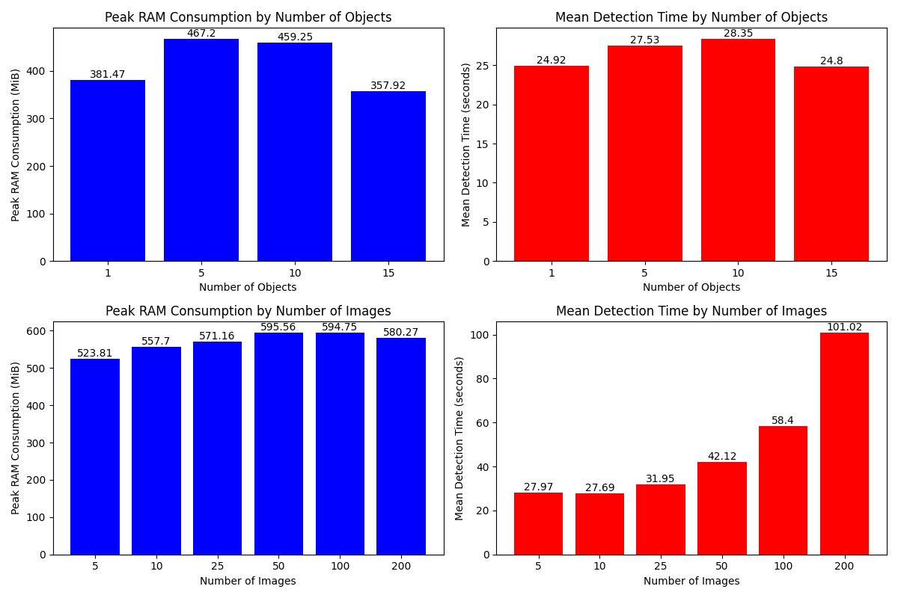

---
---

# Results From Testing

## Methodology

The methodology used for testing the model involved varying the number of objects and images, and then measuring the peak RAM consumption and mean detection time. For the first set of tests, the number of objects was varied from 1 to 15, with a corresponding number of images ranging from 6 to 18. For each scenario, the peak RAM consumption and mean detection time were recorded. In the second set of tests, the number of images was varied from 200 to 5. Again, the peak RAM consumption and mean detection time were recorded for each scenario. Each test was run with the `test_eval.py` script with two rounds (so each set of detections was done twice, to ensure accurate statistics).

This methodology allows for a good understanding of how the model's performance scales with the number of objects and images.

## Graphs

These graphs show the results of the tests in a visual format:

